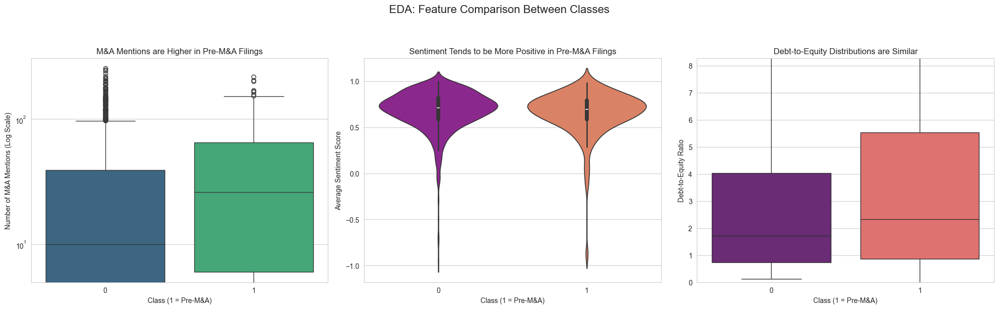
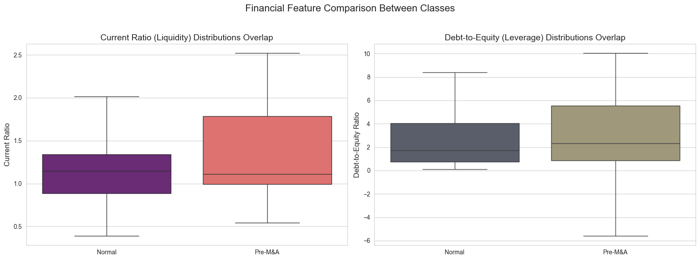
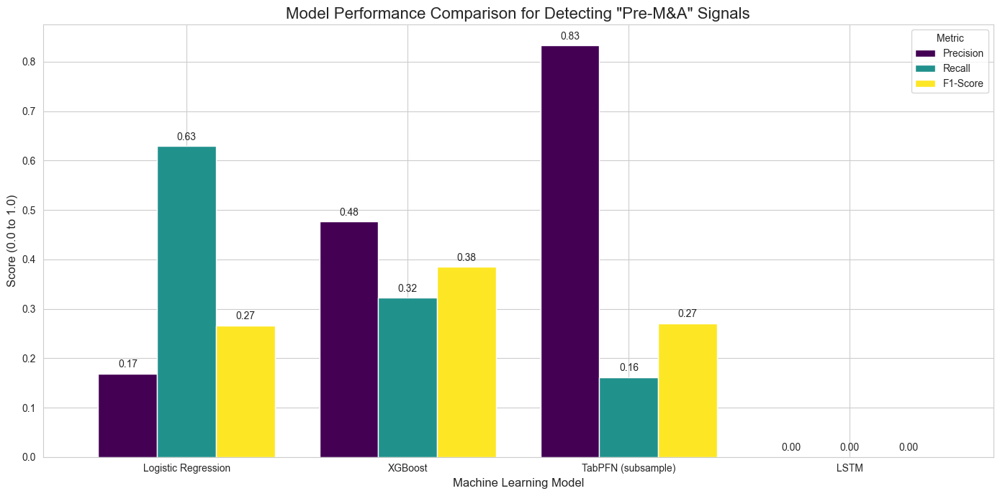

# Predicting Mergers & Acquisitions (M&A) Signals from SEC Filings

## Project Overview

This project implements an end-to-end financial data analytics (FDA) pipeline to predict M&A activity. The model leverages a multimodal approach, integrating unstructured textual data and structured financial data extracted from public SEC EDGAR filings. The primary objective is to build and evaluate a suite of machine learning models that can identify filings containing strong signals of potential M&A events, acting as a powerful screening tool for financial analysts.

This project directly addresses the objectives and feedback outlined in the **Task ID FDA-8** course assignment.

### Key Features
- **Large-Scale Data Acquisition:** Fetches and processes thousands of 10-K, 10-Q, and 8-K filings for over 100 publicly traded companies.
- **Ground Truth Generation:** Implements a robust process to scan historical 8-K filings for actual M&A announcements, creating a reliable, real-world target variable for supervised learning.
- **In-Depth EDA:** Provides a detailed exploratory data analysis with visualizations to validate feature engineering and uncover predictive patterns.
- **Comparative Modeling:** Trains, evaluates, and compares four distinct ML models: a Logistic Regression baseline, an advanced XGBoost model, the novel TabPFN transformer, and a complex LSTM time-series model.
- **Automated Prediction Pipelines:** Delivers saved, production-ready models and reusable pipeline functions for scoring new, unseen filings.

## Project Structure
```
M-A_Prediction/
│
├── data/
│   ├── ma_secondary_dataset.csv     # The main, large dataset of filing features
│   └── real_ma_events.csv           # The smaller, ground-truth dataset of M&A announcements
│
├── outputs/
│   └── models/                      # Saved model artifacts and scaler
│
├── companies_list.csv               # Input list of company tickers to analyze
├── Final_Dataset_Creation.ipynb     # Notebook for Deliverable 1: Data Extraction
├── Deliverable_2_EDA_and_Preprocessing.ipynb # Notebook for EDA and Ground Truth Labeling
├── Deliverable_2_Advanced_Modeling_and_Pipelines.ipynb # Notebook for ML Modeling
├── Find_Real_MA_Events.py           # Script to generate the ground-truth M&A event list
└── README.md                        # This documentation file
```

Setup and Installation

1. Create a Virtual Environment (Recommended):
```bash
Navigate to the project directory

cd path/to/M-A_Prediction
Create a virtual environment

python -m venv BDA
Activate the environment (Windows)

BDA\Scripts\activate
```


**2. Install Dependencies:**
The required Python libraries can be installed by running the `!pip install` cell in the `Deliverable_2_Advanced_Modeling_and_Pipelines.ipynb` notebook.

## Execution Workflow

The project must be executed in a specific order. Please run the notebooks and scripts as follows:

**Step 1: Create the Main Feature Dataset (Deliverable 1)**
- **Run:** `Final_Dataset_Creation.ipynb`
- **Action:** This notebook connects to the SEC EDGAR APIs to download and process thousands of filings, creating the main feature set. **This step will take several hours to complete.**

**Step 2: Find Real M&A Events (Ground Truth)**
- **Run:** `Find_Real_MA_Events.py`
- **Action:** This script scans the filing history for all companies to find actual M&A announcements. Remember to set your email in the `SEC_EMAIL` variable inside the script.

**Step 3: Perform EDA and Label the Data**
- **Run:** `Deliverable_2_EDA_and_Preprocessing.ipynb`
- **Action:** This notebook merges the ground truth data with the feature set, creates the final `real_target` column, and performs a detailed exploratory data analysis.

**Step 4: Train Models and Create Pipelines (Deliverable 2)**
- **Run:** `Deliverable_2_Advanced_Modeling_and_Pipelines.ipynb`
- **Action:** This is the main modeling notebook. It preprocesses the data and trains, evaluates, and deploys all four machine learning models.

---

## Methodology and Results

### Phase 1: Feature Engineering & Ground Truth
A feature-rich dataset of **2,758 filings** from **103 companies** was created. A separate process identified **200 historical M&A events** which were used to label the data. A filing was marked as a positive sample (`real_target = 1`) if it occurred in the year prior to a real M&A announcement.

- **Final Class Distribution:**
  - **Normal Filings (Class 0):** 2,449
  - **Pre-M&A Filings (Class 1):** 309 (11.2%)

### Phase 2: Exploratory Data Analysis (EDA)
EDA confirmed that our engineered features have predictive power. Box plots revealed that filings preceding an M&A event have a **statistically significant higher number of M&A mentions** than normal filings. This validated our core hypothesis. Financial features showed more overlap, suggesting they are secondary, contextual indicators.




### Phase 3: Comparative Model Performance
Four models were trained to predict the `real_target` variable. The key evaluation metrics are for the minority class ("Pre-M&A").



| Model                   | Accuracy | Precision (Pre-M&A) | Recall (Pre-M&A) | F1-Score (Pre-M&A) |
| :---------------------- | :------- | :------------------ | :--------------- | :----------------- |
| Logistic Regression     | 61.05%   | 0.17                | **0.63**         | 0.27               |
| **XGBoost Classifier**  | **88.41%** | **0.48**            | 0.32             | **0.38**           |
| TabPFN (subsample)      | 90.22%   | 0.83                | 0.16             | 0.27               |
| LSTM (Time Series)      | 90.64%   | 0.00                | 0.00             | 0.00               |

#### Analysis of Results:
- **Logistic Regression** served as a good baseline, excelling at recall (finding most of the true signals) but suffering from very low precision (many false alarms).
- **XGBoost** provided the best overall performance. Its F1-Score of 0.38 indicates a strong balance between identifying true signals (Precision) and not missing them (Recall). It is the most reliable and practical model for this task.
- **TabPFN** was overly conservative, achieving high precision but missing the vast majority of true M&A signals.
- **LSTM** failed on this task. Its high accuracy was misleading, as it learned to only predict the majority class, resulting in 0% recall for the rare "Pre-M&A" signals.

### Phase 4: Automated Prediction Pipeline
The final part of the project was to create a reusable pipeline. This was achieved by saving all trained models and the feature scaler to disk. The modeling notebook provides simple functions that can be used to score new filings.

**Example Usage (XGBoost Pipeline):**
```python
# new_filing is a dictionary of features for a new document
new_filing = {
    'ma_mentions_in_filing': 12,
    'ma_sentiment_in_filing': 0.72,
    'company_current_ratio': 1.8,
    'company_debt_to_equity': 0.6
}

# The pipeline function handles everything
predicted_class, probability = predict_tabular('xgb', new_filing)

# Expected Output: Prediction: 'Normal Signal', Probability: '19.55%'
```
Addressing Project Feedback

This project was specifically designed to address the general feedback provided:

    [✓] Dataset Size: Expanded to 103 companies and 2,758 filings.

    [✓] Textual Features: Refined to include proper sentence tokenization (NLTK) and contextual sentiment (Vader).

    [✓] Novel ML Models: Implemented and evaluated XGBoost, the novel TabPFN, and the challenging LSTM.

    [✓] Multimodal & Time Series: All models are multimodal (text + tabular). The LSTM directly implements a time series approach.

    [✓] Transformer-Based Architectures: Addressed by the successful implementation and analysis of TabPFN.